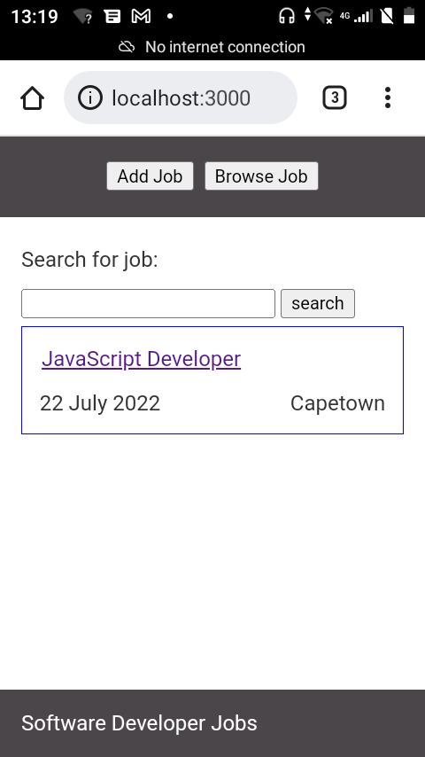
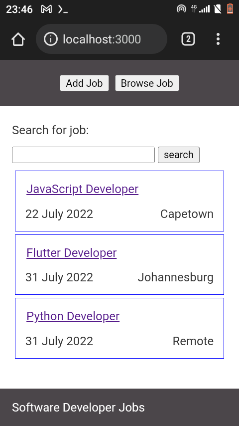

### Templating engine ( handlebars)

Now that we have our minimalist frontend template for our task. We now introducing data in our app, doing it manually in html is not really developer friendly as the project start to scale. In this tutorial we are using handlebars.

### Implementation

Go to /routes folder and open index.js
Just after declarations of packages add following code

```js
var data = {
  "title": "JavaScript Developer",
  "date": "22 July 2022",
  "location": "Capetown" 
}
```

Inside your get function remove `{ title : 'Express'}` and replace with our data which we just initiated `{ data }`

Next step go to /views folder inside index.hbs 

Remove hard coded details and add handlebars 

From this

```html
<div class="job">
   <div class="title">
      <a href="#">Javascript Developer</a>
   </div> 
   <div class="detail">
      <span class="date">
         22July 2022
      </span>
      <span class="location"> 
        Capetown
      </span>
   </div>
 </div>
 ```
 
 end result
 
 
 ```html
 <div class="job">
   <div class="title">
      <a href="#">{{data.title}}</a>
   </div> 
   <div class="detail">
      <span class="date">
         {{data.date}}
      </span>
      <span class="location"> 
        {{data.location}}
      </span>
   </div>
 </div>
 ```

Run app from termux inside job-board folder
`npm start` 



The app still look the same but under the hood handlebars is doing its thing.

### Adding more data using external json file

From termux add new file in root folder of the project

`touch data.json`

add the following in data.json file

```json
[{
  "title": "JavaScript Developer",
  "date": "22 July 2022",
  "location": "Capetown" 
},
 {
  "title": "Flutter Developer",
  "date": "31 July 2022",
  "location": "Johannesburg" 
},
 {
  "title": "Python Developer",
  "date": "31 July 2022",
  "location": "Remote" 
}]
```
 Inside /routes folder open index.js remove data assigned to data variable and link json file like
 
`var data = require('../data.json')`

Inside /views folder open index.js and make handlebars to iterate through data by using each helper.

```html
{{#each data}}
<div class="job">
  <div class="title">
     <a href="#">{{this.title}}</a>
  </div> 
  <div class="detail">
     <span class="date">
        {{this.date}}
     </span>
     <span class="location"> 
       {{this.location}}
     </span>
  </div>
</div>
{{/each}}
```

Result



### Handlebars (  hbs partials )

Open app.js file and add dependency

```js
var hbs = require('hbs')
```

```js
hbs.registerPartials(__dirname + '/views/partials', function (err) {});
```

From project folder go inside /views folder and create a folder called /partials enter the folder and create two files which for our project we want a header.hbs and footer.hbs

Folder should look like below

